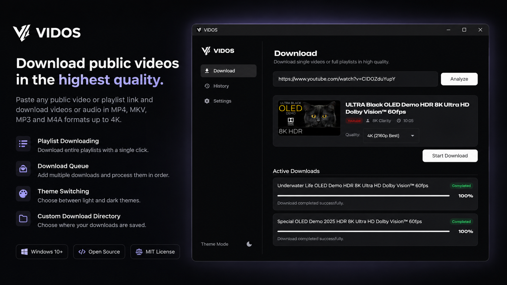

# 🎬 VIDOS — Video Downloader

A simple desktop app for downloading videos and playlists. Nothing fancy, just works. ✨



---

## 🛁 The Story

This app was born at a laundry. Sitting there, waiting for the clothes to dry, with nothing to do — so I built this. What started as a way to kill time turned into a proper little tool I actually use every day.

---

## ✨ What It Does

- 📥 **Download videos** from your favorite sites
- 📋 **Download full playlists** — pick which ones you want
- 🎵 **Audio only** — grab just the MP3 if that's all you need
- 🌍 **Available in 8 languages** — English, German, Russian, French, Spanish, Portuguese, Turkish & Indonesian
- 🌙 **Dark & Light mode** — looks good either way
- 📂 **Choose where to save** your files

---

## 🚀 How to Run

> You'll need **Python 3.10+** installed first.

```bash
# 1. Install dependencies
pip install -r requirements.txt

# 2. Run the app
python main.py
```

That's it. 🎉

---

## 📄 License

[MIT](LICENSE) — free to use, free to share.
